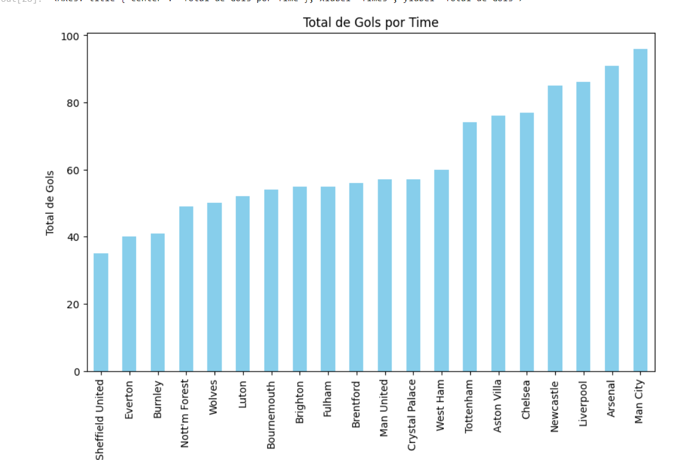

# Analise_Premier2324

 Começando minha jornada no mundo da ciência de dados resolvi fazer algumas análises simples da Liga Inglesa de Futebol Premier League em Python, que estão em um arquivo em formato CSV (<a href="./Conteudos/season-2324.csv">Premier League CSV</a>). No total foram 8 análises, tentando buscar cada vez mais dificuldade em cada uma delas e aprender um pouco mais de python.

 ___

 <h4>ARQUIVO CSV<h4></h4> 

 Agora falando um pouco mais sobre o arquivo CSV. O Aquivo mostra cada partida realizada na Temporada 23/24 da Premier League com um total de 21 colunas. Os dados mais relevantes e utilizados nas minhas análises foram **<mark>Time da Casa</mark>**, **<mark>Time de Fora</mark>**, **<mark>Gols marcados Time da Casa</mark>**, **<mark>Gols marcados Time de Fora</mark>**, **<mark>Resultado</mark>**, **<mark>Gols_marcadosCasa</mark>**, **<mark>Gols 1° Casa</mark>**, **<mark>Gols 1° Fora</mark>**, **<mark>Resultado do 1° Tempo</mark>**, **<mark>Gols_marcadosCasa</mark>**.

___

<h4>CODIFICANDO<h4>

### Primeiros Passos

Primeiramente precisamos ler o arquivo CSV e importar as bibliotecas

```python
import pandas as pd
import numpy as np
data_team = pd.read_csv("season-2324.csv")
```

Após isso eu quero ver como a tabela esta estrutura então eu coloco o seguinte código:

```python
data_team.head()
```


Esse código me permite análisar as cinco primeiras linhas da tabela. Após a análise vi que o nome das colunas ficavam difícil o entendimento, logo mudei o nome de todas as colunas para facilitar na hora das análises.

```python
data_team.columns=["Data", "Casa", "Fora", "Gols_marcadosCasa", "Gols_marcadosFora", "Resultado", "Gols_1_Casa", "Gols_1_Fora", "Resultado_1", "Arbitro", "Chutes_Casa", "Chutes_Fora", "ChutesAlvo_Casa", "ChutesAlvo_Fora", "Faltas_Casa", "Faltas_Fora", "Escanteio_Casa", "Escanteio_Fora", "Amarelo_Casa", "Amarelo_Fora", "Vermelho_Casa", "Vermelho_Fora"]
```


### Análises

A **PRIMEIRA** análise feita foi o desempenho do time Burnley em sua casa, ou seja, em seu Estádio. Nós armazenamos em cada variável as derrotas, empates e vitórias do Burnley em casa

```python
total_jogos_ganhos = data_team.query("(Resultado == 'H') & (Casa == 'Burnley')").Resultado.value_counts()['H']
total_jogos_perdidos = data_team.query("(Resultado == 'A') & (Casa == 'Burnley')").Resultado.value_counts()['A']
total_jogos_empatados = data_team.query("(Resultado == 'D') & (Casa == 'Burnley')").Resultado.value_counts()['D']
```

Logo em seguidas criamos um dicionário

```python
dados = {
    "Desempenho": ["Vitórias", "Derrotas", "Empates"],
    "Total": [total_jogos_ganhos,total_jogos_perdidos, total_jogos_empatados],
}
```

Criamos um dataframe antes e por fim criamos um gráfico de barras com a biblioteca Pandas:

```python
dados.plot.bar(x="Desempenho", y="Total", rot = 45)
```


A **SEGUNDA** análise feita foi o a derrota do time Burnley em casa de acordo com os meses. Como nesse aquivo não possuia uma coluna para os meses tivemos que criar uma. 

```python
data_team['Data'] = pd.to_datetime(data_team['Data'], format='%d/%m/%y')

data_team['Mes'] = data_team['Data'].dt.month
```
Explicando um pouco mais, nesse código nós primeiro formatamos a data, depois disso criamos uma nova coluna chamada 'Mes' e armazenamos apenas o mês nela.

Após isso eu crio um dicionário criando uma chave cada mês e armazenando o valor nessas chaves

```python
meses = {
    "Janeiro": data_team.query("(Mes == 1) & (Casa == 'Burnley')")['Resultado'].value_counts().get("A", 0),
    "Fevereiro": data_team.query("(Mes == 2) & (Casa == 'Burnley')")['Resultado'].value_counts().get("A", 0),
    "Março": data_team.query("(Mes == 3) & (Casa == 'Burnley')")['Resultado'].value_counts().get("A", 0),
    "Abril": data_team.query("(Mes == 4) & (Casa == 'Burnley')")['Resultado'].value_counts().get("A", 0),
    "Maio": data_team.query("(Mes == 5) & (Casa == 'Burnley')")['Resultado'].value_counts().get("A", 0),
    "Junho": data_team.query("(Mes == 6) & (Casa == 'Burnley')")['Resultado'].value_counts().get("A", 0),
    "Julho": data_team.query("(Mes == 7) & (Casa == 'Burnley')")['Resultado'].value_counts().get("A", 0),
    "Agosto": data_team.query("(Mes == 8) & (Casa == 'Burnley')")['Resultado'].value_counts().get("A", 0),
    "Setembro": data_team.query("(Mes == 9) & (Casa == 'Burnley')")['Resultado'].value_counts().get("A", 0),
    "Outubro": data_team.query("(Mes == 10) & (Casa == 'Burnley')")['Resultado'].value_counts().get("A", 0),
    "Novembro": data_team.query("(Mes == 11) & (Casa == 'Burnley')")['Resultado'].value_counts().get("A", 0),
    "Dezembro": data_team.query("(Mes == 12) & (Casa == 'Burnley')")['Resultado'].value_counts().get("A", 0),
}
```

Crio o dataframe e novamente coloco em um gráfico de barras 

```python
df_meses.plot.bar(x='Mês', y='Derrotas')
```


A **TERCEIRA** análise feita foi os gols no primeiro e segundo tempo do Man. City. Nessa análise nós só tinhamos os gols marcados no primeiro tempo e gols totais, ou seja, para conseguimos os gols do segundo tempo era preciso fazer uma subtração dos gols totais menos o do primeiro tempo. 

```python
city_gol_1_casa = data_team.query("Casa == 'Man City'")["Gols_1_Casa"].sum()
city_gol_1_fora = data_team.query("Fora == 'Man City'")["Gols_1_Fora"].sum()
city_1 = city_gol_1_casa + city_gol_1_fora
```

Nessa primeira parte nós armazenamos os valores dos gols do primeiro tempo tanto dentro de casa quanto fora e fizemos a somatória. 


```python
city_gol_casa = data_team.query("Casa == 'Man City'")["Gols_marcadosCasa"].sum()
city_gol_fora = data_team.query("Fora == 'Man City'")["Gols_marcadosFora"].sum()
city_gols = city_gol_casa + city_gol_fora
```

Já nessa nós armazenamos os gols totais de dentro e fora de casa e fizemos a somatória também. 

Por fim nós criamos uma variável que armazenava a subtração das duas variáveis.

```python
gol_2 = city_gols - city_1
```

Novamente criamos o dicionário e criamos o dataframe

```python
gols_city= {
    "tempos": ["1º Tempo", "2º Tempo"],
    "gols": [city_1, gol_2]
}

gols_city = pd.DataFrame(gols_city)
```

Por fim colocamos essas informações no gráfico de barras:

```python
gols_city.plot.bar(x="tempos", y="gols", title="Gols do Man City nos Tempos do jogo")
```


A **QUARTA** análise feita foi os gols de todos os times durante a Premier League e a quantidade de gols feita no primeiro e no segundo tempo de cada time.

Primeiramente eu crio 3 dicionários vazios que irão armazenar o total de gols, os gols dos times no primeiro tempo e o gols dos times no segundo tempo

```python
gols_por_time = {}
gols_1_por_time = {}
gols_2_por_time = {}
```

Em seguida nós criamos um loop de acordo com a quantidade de index existente na tabela, neste loop ele fará duas coisas, primeira armzenar todos os gols dos times e segunda armazenará a todos os gols dos times no primeiro tempo.

```python
for i in data_team.index:
    time_casa = data_team.loc[i, "Casa"]
    gols_casa = data_team.loc[i, "Gols_marcadosCasa"]
    time_fora = data_team.loc[i, "Fora"]
    gols_fora = data_team.loc[i, "Gols_marcadosFora"]


    time_Casa_1 = data_team.loc[i, "Casa"]
    gols_Casa_1 = data_team.loc[i, "Gols_1_Casa"]
    time_fora_1 = data_team.loc[i, "Fora"]
    gols_fora_1 = data_team.loc[i, "Gols_1_Fora"]

    if time_casa in gols_por_time:
        gols_por_time[time_casa] += gols_casa
    else:
        gols_por_time[time_casa] = gols_casa

    if time_fora in gols_por_time:
        gols_por_time[time_fora] += gols_fora
    else:
        gols_por_time[time_fora] = gols_fora

    if time_Casa_1 in gols_1_por_time:
        gols_1_por_time[time_Casa_1] += gols_Casa_1
    else:
        gols_1_por_time[time_Casa_1] = gols_Casa_1

    if time_fora_1 in gols_1_por_time:
        gols_1_por_time[time_fora_1] += gols_fora_1
    else:
        gols_1_por_time[time_fora_1] = gols_fora_1
```

Vamos explicar parte por parte. 

Nessa parte criamos variáveis que irão localizar as seguintes informações: O time da casa/fora e os gols do time da casa/fora

```python
    time_casa = data_team.loc[i, "Casa"]
    gols_casa = data_team.loc[i, "Gols_marcadosCasa"]
    time_fora = data_team.loc[i, "Fora"]
    gols_fora = data_team.loc[i, "Gols_marcadosFora"]
```

Assim como na parte de cima acontece a mesma coisa, mas relacionado com o primeiro tempo

```python
   time_Casa_1 = data_team.loc[i, "Casa"]
    gols_Casa_1 = data_team.loc[i, "Gols_1_Casa"]
    time_fora_1 = data_team.loc[i, "Fora"]
    gols_fora_1 = data_team.loc[i, "Gols_1_Fora"]
```

Logo em seguida nós fizemos uma condicional onde caso ja exista o time no dicionário `gols_por_time = {}` ele spenas some os gols e caso não tenha ele adiciona o time no dicionário com o valor dos gols.

```python
   if time_casa in gols_por_time:
        gols_por_time[time_casa] += gols_casa
    else:
        gols_por_time[time_casa] = gols_casa

    if time_fora in gols_por_time:
        gols_por_time[time_fora] += gols_fora
    else:
        gols_por_time[time_fora] = gols_fora
```

Ele faz a mesma coisa na hora de armazenar os gols dos times marcados no primeiro tempo

```python
    if time_Casa_1 in gols_1_por_time:
        gols_1_por_time[time_Casa_1] += gols_Casa_1
    else:
        gols_1_por_time[time_Casa_1] = gols_Casa_1

    if time_fora_1 in gols_1_por_time:
        gols_1_por_time[time_fora_1] += gols_fora_1
    else:
        gols_1_por_time[time_fora_1] = gols_fora_1
```

Agora nós ja temos os gols totais marcados pelos times no campeonato e os gols do primeiro tempo, mas está faltando os gols do segundo tempo. Então nós fazemos outro loop onde percorremos todo o dicionário de `gols_por_time` e caso tenha o time dentro do dicionário `gols_1_por_time` ele subtrai os gols totais menos os gols do primeiro tempo, caso não ele apenas adiciona o time no dicionário com com os gols totais.

```python
    for time in gols_por_time:
    if time in gols_1_por_time:
        gols_2_por_time[time] = gols_por_time[time] - gols_1_por_time[time]
    else:
        gols_2_por_time[time] = gols_por_time[time]
```

Por fim mostramos essas três variáveis em um gráfico 

**<h5>Gols Totais</h5>**

```python
gols_series = pd.Series(gols_por_time)
gols_series = gols_series.sort_values(ascending=True)
gols_series.plot(kind='bar', title="Total de Gols por Time", ylabel="Total de Gols", xlabel="Times", color='skyblue', figsize=(10, 6))
```



**<h5>Gols Por Etapa</h5>**

```python
gols_df = pd.DataFrame({
    "Primeiro Tempo": gols_1_por_time,
    "Segundo Tempo": gols_2_por_time
})

gols_df.sort_values(by="Primeiro Tempo", ascending=True, inplace=True)

gols_df.plot.bar(figsize=(17, 6), color=['skyblue', 'lightgreen'], title="Gols por Time: 1º e 2º Tempo")
```


A **QUINTA** análise feita foi o desempenho dos times na temporada na Premier League dentro de casa

Nele nós criamos um dicionário o `desempenho = {}` onde irá armazenar o nome do time e suas Vitórias, empates e derrotas

Nós primeiro criamos um loop de acordo com os index do arquivo CSV

```python
for i in data_team.index:
    times = data_team.loc[i, "Casa"]
    resultado = data_team.loc[i, "Resultado"]

    if times in desempenho:
        if resultado == "H":
            desempenho[times]["vitória"] += 1
        elif resultado == "A":
            desempenho[times]["derrota"] += 1
        else:
            desempenho[times]["empate"] += 1
    else:
        desempenho[times] = {"vitória": 0, "empate": 0, "derrota": 0}
```

Nele nós criamos duas variáveis uma que busca o time da casa e outra que localiza o resultado 

```python
    times = data_team.loc[i, "Casa"]
    resultado = data_team.loc[i, "Resultado"]
```

Em seguida temos a condicional que caso o time ja esteja em desempenho nós verificamos qual o resultado e adicionamos mais um a ele, caso não nós colocamos ele no dicionário e colocamos todos os valores dele igual a zero

```python
    if times in desempenho:
        if resultado == "H":
            desempenho[times]["vitória"] += 1
        elif resultado == "A":
            desempenho[times]["derrota"] += 1
        else:
            desempenho[times]["empate"] += 1
    else:
        desempenho[times] = {"vitória": 0, "empate": 0, "derrota": 0}
```

Após isso criamos um dataframe e um gráfico de barras.

```python
df_desempenho = pd.DataFrame.from_dict(desempenho, orient="index")

df_desempenho.index.name = "Time"

df_desempenho.plot(kind="barh", figsize=(10, 20), title="Desempenho dos Times em Casa", ylabel="Quantidade", xlabel="Time", palette = ""
```
